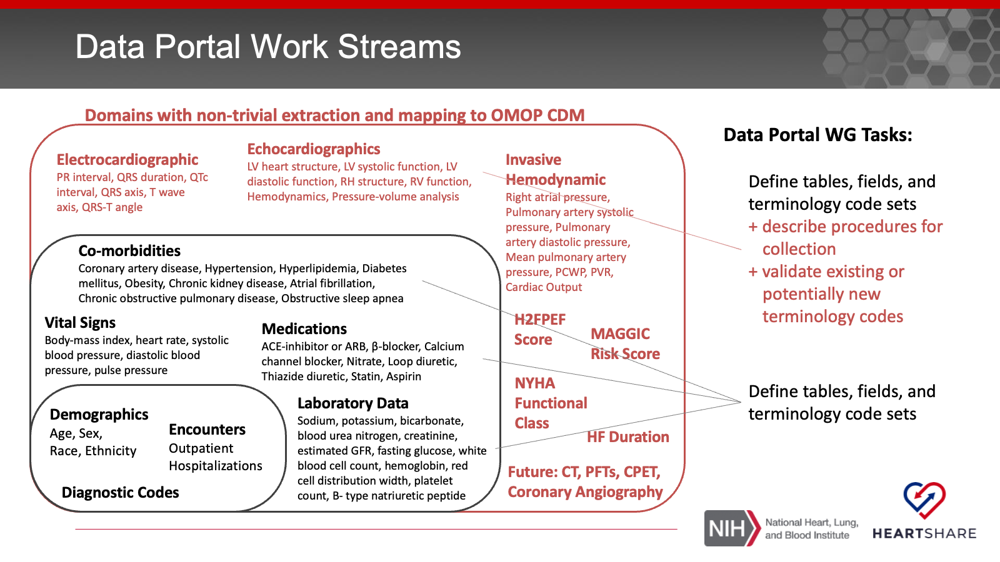
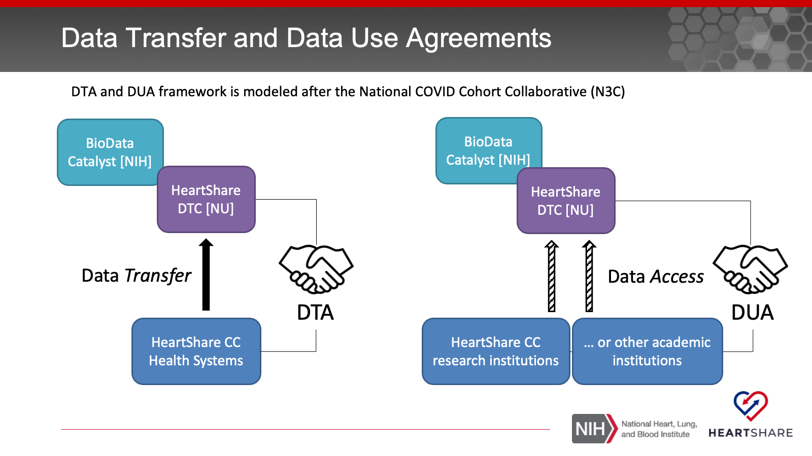
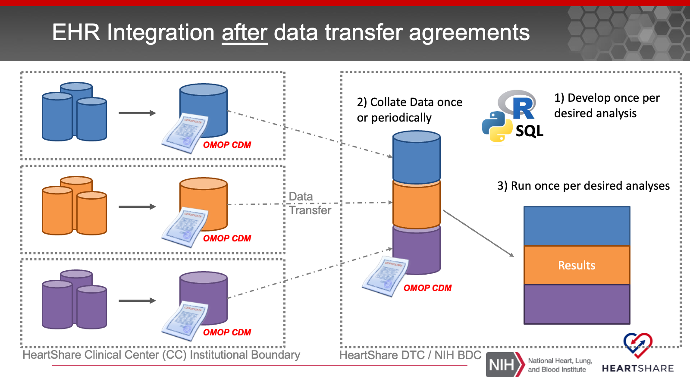

# The Data Portal and EHR Integration Working Group {#dpehri}

## Mandate {#dpehri_mandate}

The EHR integration and Data Portal WG will be the forum for design and implementation of data models, workflows, and interrelated platforms for integrating the diverse datasets and data resources applicable to HeartShare.

Working closely with informatics and data science professionals across the consortium, the EHRI and DP WG will ensure that the processes for acquiring and integrating data -- including extant cohorts, EHR, and imaging data -- are sound, secure, effective, and adherent with the research protocols of HeartShare.

## EHR Integration Purpose {#dpehri_aim}

The goal is to functionally integrate clinical care data for HF patients and their comparator group from the HeartShare Clinical Centers (CCs). These data sets are not intended for discovery of novel HFpEF phenotypes. Rather they will be used to:

-   Describe and characterize the scope, composition and ready availability of EHR data for HF patients across HeartShare
-   Aid the identification and enrollment of HF and HFpEF patients with bespoke clinical features into the HeartShare Study if and when needed
-   Provide a platform for the real-world application of EHR-based HFpEF phenotypes which can be used to find patient sub-populations and drive iterative phenotype validation and refinement.
-   Resource for investigators interested in multi-site analyses e.g. study the uptake of specific treatments, gather pilot data to support ancillary grants, or trainees working on their projects


## Whose EHR Records Are Collected and for What Time Span? {#dpehri_whose}

Broadly speaking the EHR records that are included in the HeartShare data calls are for Heart Failure patients and their comparator groups from the HeartShare Clinical Centers (CC). For these cohorts, we aim to collect **retrospective** longitudinal data. In other words we are looking to gather as complete a longitudinal picture of these patients' HF journey as we can, even prior to the launch of the HeartShare study or even their HF diagnosis. Based on technical feasibility, analysis aims, and regulatory requirements the retrospective data set may be collected once (one time) or collected once then periodically updated (one time with "top offs"). In the latter case, the DP and EHRI WG in consultation with the HeartShare CCs will determine the adequate scope and frequency of the data set updates.

It is also useful to highlight the two cohort categories below:

### The Entire Pool of HF Patients with EHR Records

This is a broad category and intended to include *all* HF patients and their appropriate comparator groups with EHR records at HeartShare CCs. Since this category is broad and includes current and past patients who are not HeartShare participants, the regulatory framework for collecting and analyzing their EHR data will depend on obtaining a waiver of HIPAA authorization from the local IRBs and privacy boards. 

### Patients Enrolled in HeartShare

This category is a subset of the category above and includes patients who are enrolled into HeartShare studies via the Eureka platform. These participants provide informed consent and HIPAA authorization for sharing their EHR data, so the regulatory pathway for accrual and sharing of their health information is likely to be more permissive. The accrual of these patients will be ongoing and will include ongoing encounters with the HeartShare CC HF clinics; therefore, this group will likely require regular EHR data aggregation and "topping off" during their active participation in HeartShare studies. This category includes participants in the **HeartShare HF Registry** (previously referred to as the "light touch registry"), the **HeartShare Deep Phenotyping Cohort (DPC)**, and **their comparator groups**.

## What EHR Data Are in Scope?

The data domains that will be included will be prioritized based on their relevance to the HeartShare scientific goals. Informed by the overall aims of HeartShare and the unfolding of the main studies, the DP and EHRI WG will work to define the EHR domains following an incremental approach. The following diagram shows a high level roadmap of the domains we will be seeking, starting with the innermost sets and expanding outwards. Note that there will be domains (red) for which there may not be clear pathway for mapping to the OMOP CDM. In addition to specifying the requirements, the DP and EHRI WG will set guidelines on the procedures for obtaining data from ancillary data sources where they reside. Furthermore, there may be a need to examine the pertinent vocabularies and propose additions where needed. (e.g. by working through the OHDSI community's [CDM Refresh Process](http://ohdsi.github.io/CommonDataModel/cdmRefreshProcess.html).) This will offer an opportunity for the work in HeartShare to inform EHR-based phenotyping in the field in general.


```{r, echo=FALSE}

```

## How Will EHR Data Be Extracted and Prepared for Analysis?

There will be two steps for data extraction and harmonization into a format amenable to uniform analysis across all HeartShare CCs.

```{r, echo=FALSE}
knitr::include_graphics("images/heartshareamp_ehr_to_omop.png")
```


### Local EHR Query: Cohort Identification and Domain Selection. 

This step is highly variable and depends on the local EHR data stores within each CC. This step will rely on cohort definitions to identify the appropriate patients. In this step, only the domains salient to the current data calls will be included (filter-in approach).

### Extract, Transform, Load: Harmonization Using the OMOP CDM

In this step, the exported records with the associated domain field values will be transformed into relational database tables that are concordant with the OHDSI OMOP Common Data Model (CDM).


## Where Will the EHR Data Be Analyzed?

The HeartShare DTC will work with the HeartShare CCs to develop appropriate data transfer agreements (DTA) that cover the different subsets of patient populations in the shared EHR data. Furthermore, all institutions whose investigators will require access to the data will need to sign a data use agreement (DUA).


```{r, echo=FALSE}

```


There are two workflows for data analysis.


```{r, echo=FALSE}
knitr::include_graphics("images/heartshare_ehr_localanalysis.png")
```

**Scenario 1:** local analysis because a DTA is not feasible for a given population or a DTA has not been signed yet, followed by pooling of analysis results

```{r, echo=FALSE}

```

**Scenario 2**: pooling of data into the a central location managed by the HeartShare DTC followed by one central analysis
